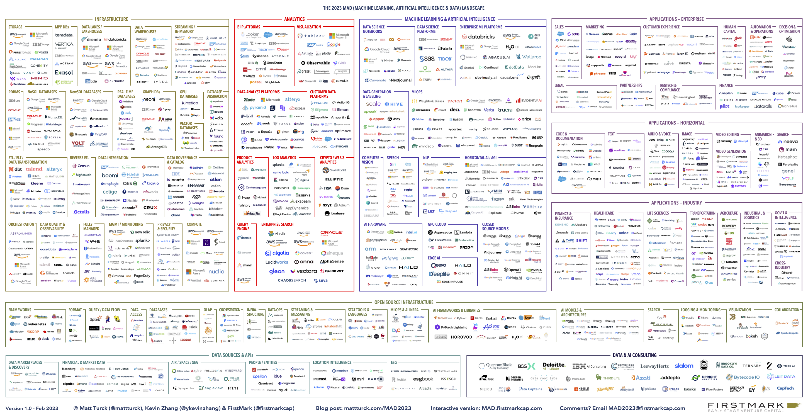
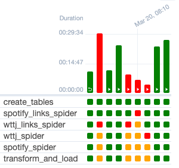
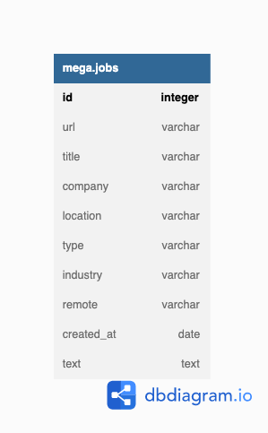
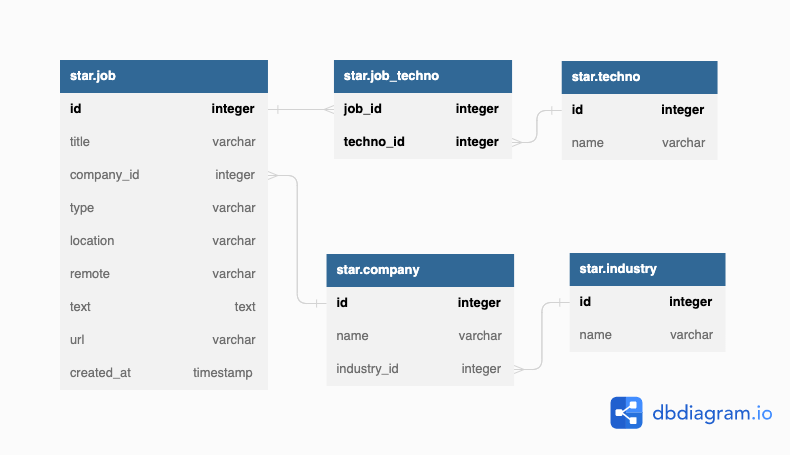

# Data Engineering Job Market

After finishing a bootcamp in 2022, I was feeling restricted by a conception of data engineering that was technology-centered. 
Months later, thanks to O'Reilly's _Fundamentals of Data Engineering_, I had more clarity with the role. 
But the variety of technical skills is still a major consideration when applying to jobs. 

This project is trying to achieve 2 things. First it's a tool to look up jobs gathered from various sources. 
The secondary goal is to gain insight into technologies present on the data engineering job market 
using Matt Turck's Data Landscape 
which I also want to elaborate on my [website](http://bit.ly/3lC4AIz).


[The 2023 MAD Landscape - Matt Turck at FirstMark](https://mattturck.com/mad2023/#more-1693)

****
#### Contents

- [Architecture](#architecture)
- [Testing](#testing)
  - [End-to-end tests](#end-to-end-tests)
  - [Data quality testing](#data-quality-testing)
  - [Monitoring](#monitoring)
  - [Unit testing](#unit-testing)
- [Data Lifecycle](#data-lifecycle)
  - [Source System](#source-system)
  - [Ingestion](#ingestion)
  - [Transformation](#transformation)
  - [Serving](#serving)
  - [Storage](#storage)
  - [Orchestration](#orchestration)
- [How to run](#how-to-run)

****

## Architecture

A minimal pipeline using Python scripts, Postgres, Airflow and Tableau. 
Links to Python scripts :
- Crawler: [data-job-crawler](https://github.com/FelitaD/data-job-crawler)
- ETL pipeline: [data-job-etl](https://github.com/FelitaD/data-job-etl)  
- API: [data-job-api](https://github.com/FelitaD/data-job-api)


C4 model diagrams: https://structurizr.com/workspace/79499/diagrams

## Testing

Tests below do not measure intermediary steps. For individual pipelines tests see their respective repositories.

### Airflow Tests

- Test the DAG: `python3 job_market_etl_dag.py`
- Import time: `time python3 job_market_etl_dag.py`. Maximum is 30 seconds.
- Unit tests for loading the DAG: `pytest test/`
- Test tasks individually: 
  - `airflow tasks test job-market-batch create_tables 2022-01-01`
  - `airflow tasks test job-market-batch spotify_links_spider 2022-01-01`
  - `airflow tasks test job-market-batch wttj_links_spider 2022-01-01`
  - `airflow tasks test job-market-batch spotify_spider 2022-01-01`
  - `airflow tasks test job-market-batch wttj_spider 2022-01-01`
  - `airflow tasks test job-market-batch transform_and_load 2022-01-01`
- Backfill (takes account of dependencies): `airflow dags backfill job-market-batch --start-date 2023-01-01`

### End-to-end Test

After at least one successful DAG run (all tasks green and supposedly no errors in the logs), we can take a random job url from [here](https://www.welcometothejungle.com/fr/jobs?page=1&aroundQuery=&query=data%20engineer&refinementList%5Bcontract_type_names.fr%5D%5B%5D=CDI&refinementList%5Bcontract_type_names.fr%5D%5B%5D=CDD%20%2F%20Temporaire&refinementList%5Bcontract_type_names.fr%5D%5B%5D=Autres&refinementList%5Bcontract_type_names.fr%5D%5B%5D=VIE&refinementList%5Bcontract_type_names.fr%5D%5B%5D=Freelance) and use it to query the final table while replacing everything after `?` with `%`. Example:
```
SELECT title, company, technos, created_at, url FROM pivotted_jobs WHERE url LIKE 'https://www.welcometothejungle.com/fr/companies/foxintelligence/jobs/senior-data-analyst-team-quality_paris%' ORDER BY created_at;
```

Sometimes Airflow's tests will pass but not the DAG run because of the configuration file. For example, the `hostname_callable = socket:getfqdn` will return different hostname values from time to time, explaining the strange behaviour below (solution: set to `socket:gethostname`).



### Data Quality Testing

- All technologies must be present
- Eliminate duplicates by changing the url field and removing the last part
- [Checklist](https://www.montecarlodata.com/blog-data-quality-testing/)

### Monitoring

To be completed.

### Unit Testing

To be completed.

## Data Lifecycle

### Source system

The data sources are the web pages containing results for the latest data engineering jobs.  The project started with [Spotify](https://www.lifeatspotify.com/jobs?c=engineering&c=data&l=london&l=stockholm&l=remote-emea&l=paris) and [Welcome To The Jungle](https://www.welcometothejungle.com/fr/jobs?page={page_number}&aroundQuery=&query=data%20engineer&refinementList%5Bcontract_type_names.fr%5D%5B%5D=CDI&refinementList%5Bcontract_type_names.fr%5D%5B%5D=CDD%20%2F%20Temporaire&refinementList%5Bcontract_type_names.fr%5D%5B%5D=Autres&refinementList%5Bcontract_type_names.fr%5D%5B%5D=VIE&refinementList%5Bcontract_type_names.fr%5D%5B%5D=Freelance) where I found my first tech job.

Characteristics:
- Javascript based pages require additional scraping library Playwright
- HTML will eventually change and requires detection as well as manual update of the XPath
- Different websites can show more or less fields (eg. remote policy) which will result in null values
- Schema evolution can occur
- If a job offer appears on at least 2 scraped websites, need to deal with duplicate

### Ingestion

The ingestion is made with Scrapy framework which adds a pipeline feature that conform the data into predefined fields and writes them to the database.

### Transformation

All transformations are made with Python in a specific ETL pipeline [data-job-etl](https://github.com/FelitaD/data-job-etl).
The processing consists of cleaning and reformatting fields and extracting the technology names from the text field into a new column. The data is finally modelled to be loaded in a new database.

### Storage

PostgreSQL is used as OLTP and OLAP stores. The data is uniformely structured with a small read and write workload.

#### Schema 

The raw data is stored in a mega relation. The field `text` is the biggest but should not reach the 1 GB capacity limitation. 
Once transformed, the data is loaded in a new table without normalization. A future implementation would differentiate 2 databases with the schemas:

 

### Orchestration

Airflow is run locally. Following best practices, the custom code is encapsulated in python packages then imported in the DAG.

## How to run

### Prerequesites

- Setup environment 
  - Activate venv and install requirements
  - Execute `playwright install` to download chromium
- Install Airflow with pypi: [official instructions](https://airflow.apache.org/docs/apache-airflow/stable/installation/installing-from-pypi.html)
- Create `job_market` database and export environment variables `JOB_MARKET_DB_USER` and `JOB_MARKET_DB_PWD`   

### Run

- ```airflow standalone``` will initialise Airflow database, make a user, and start all components (development phase).<br>  
- Airflow UI is at `localhost:8080` with username `admin` and password in `standalone_admin_password.txt`
- In DAGs tab, toggle on job-market-batch and trigger manually if not running.  


[Back to contents](#contents)