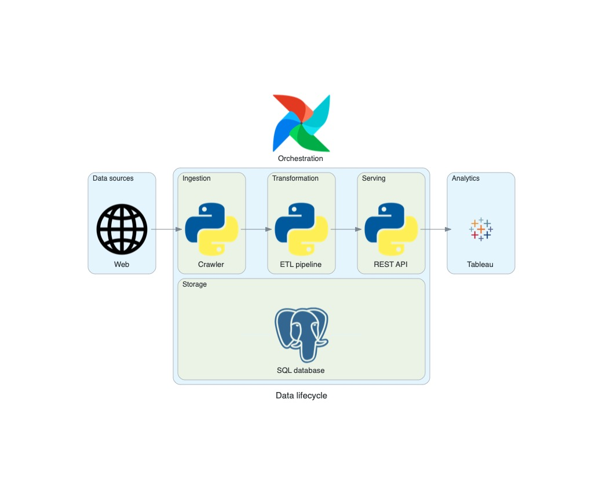
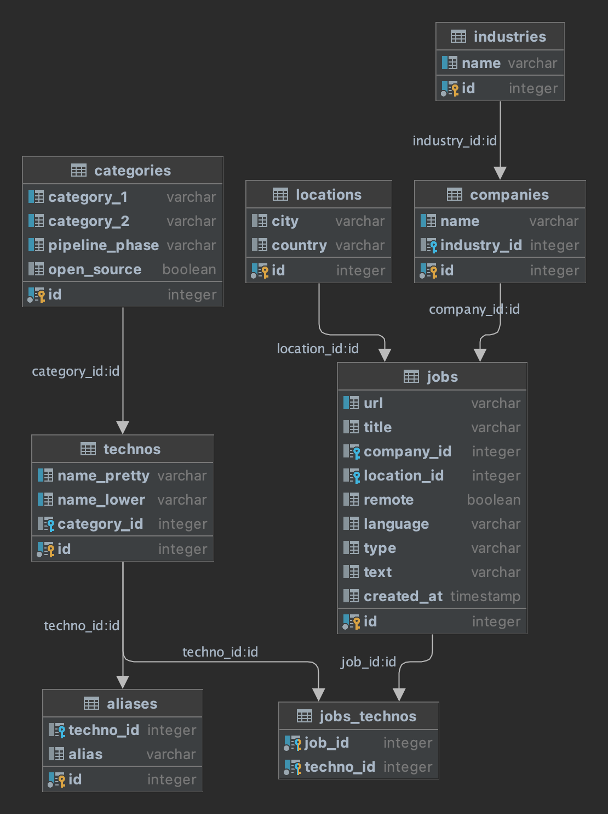

# Data Engineering Job Market

- [Project Overview](#project-overview)
- [Architecture](#architecture)
- [Testing](#testing)
  - [End-to-end tests](#end-to-end-tests)
  - [Data quality testing](#data-quality-testing)
  - [Monitoring](#monitoring)
  - [Unit testing](#unit-testing)
- [Data Lifecycle](#data-lifecycle)
  - [Source System](#source-system)
  - [Ingestion](#ingestion)
  - [Transformation](#transformation)
  - [Serving](#serving)
  - [Storage](#storage)
  - [Orchestration](#orchestration)
- [How to run](#how-to-run)

## Project Overview

The purpose of this project is to have a better idea of the data engineering job market. 
The initial goal was to answer certain questions for my job hunt in order to skill up in the right areas. For example, what technologies are the most used by companies in Europe ? What data stack is the most asked for Junior positions ? Etc.
This repo contains Airflow's DAG which uses custom code through python packages : 
- Crawler : [data-job-crawler](https://pypi.org/project/data-job-crawler/)
- ETL pipeline : [data-job-etl](https://github.com/FelitaD/data-job-etl)  
- API : [data-job-api]()


## Architecture



## Testing

### End-to-end Tests

### Data Quality Testing

### Monitoring

### Unit Testing


## Data Lifecycle

### Source system

The data sources are the web pages containing results for the latest data engineering jobs.  The project started with [Spotify](https://www.lifeatspotify.com/jobs?c=engineering&c=data&l=london&l=stockholm&l=remote-emea&l=paris) and [Welcome To The Jungle](https://www.welcometothejungle.com/fr/jobs?page={page_number}&aroundQuery=&query=data%20engineer&refinementList%5Bcontract_type_names.fr%5D%5B%5D=CDI&refinementList%5Bcontract_type_names.fr%5D%5B%5D=CDD%20%2F%20Temporaire&refinementList%5Bcontract_type_names.fr%5D%5B%5D=Autres&refinementList%5Bcontract_type_names.fr%5D%5B%5D=VIE&refinementList%5Bcontract_type_names.fr%5D%5B%5D=Freelance) where I found my first tech job.

Characteristics :
- Javascript based pages require additional scraping library Playwright
- HTML will eventually change and requires detection as well as manual update of the XPath
- Different websites can show more or less fields (eg. remote policy) which will result in null values
- Schema evolution is not expected
- If a job offer appears on at least 2 scraped websites, how will the duplicate be detected

### Ingestion

The ingestion is made with the Scrapy framework that pulls the web data. It adds a pipeline feature which formats the data into predefined fields and writes into a database in a batch process.

All the ingestion work is encapsulated in one of the two python packages (best practices with Airflow) [data-job-crawler](https://github.com/FelitaD/data-job-crawler).


### Transformation

All transformations are made with Python in a specific ETL pipeline [data-job-etl](https://github.com/FelitaD/data-job-etl).
The processing consist of cleaning and reformatting certain fields and extracting the technology names from the text field into a new column. The data is finally modelled to be loaded in a new database.

### Storage

PostgreSQL is the only type of storage is used accross the whole pipeline due to the non necessity of using NoSQL stores since it has structured data of small size and small read/write workload.

Capacity limitations :
- Relation max size 32 TB
- Field max size 1 GB
- 1600 columns max

Schemas :
- Raw data is a single mega relation
- Processed data is normalized
- Pivotted data is transformed specially for use in Tableau



### Orchestration

Airflow coordinates the workflow of the ingestion through the transformation. As mentioned earlier, the custom Python code has been packaged then imported in the DAG to follow best practices. The downside is the need to make a release each time the code changes. 

## How to run

Everything was run in development stage locally.  
  
- Install custom packages from pypi  
  - Data ingestion : [data-job-crawler](https://pypi.org/project/data-job-crawler/)  
  - Data processing : [data-job-etl](https://pypi.org/project/data-job-etl/)  
- Execute `playwright install` to enable playwright library used to scrape Javascript web pages.  
  
- Install Airflow : [installation instructions](https://airflow.apache.org/docs/apache-airflow/stable/installation/installing-from-pypi.html)  
   
- Create Postgres database `job_market` with username `JOB_MARKET_DB_USER` and password `JOB_MARKET_DB_PWD` as environment variables.   
  
- Run ```airflow standalone``` to initialise the Airflow database, make a user, and start all components (development phase).<br>  
- Visit Airflow UI `localhost:8080` in the browser and use the admin account details shown on the terminal to login, or username `admin`   
- password in `standalone_admin_password.txt` or `findajob`  
  - In the DAGs tab, toggle on job-market-batch. Trigger the DAG manually if it's not running.  
