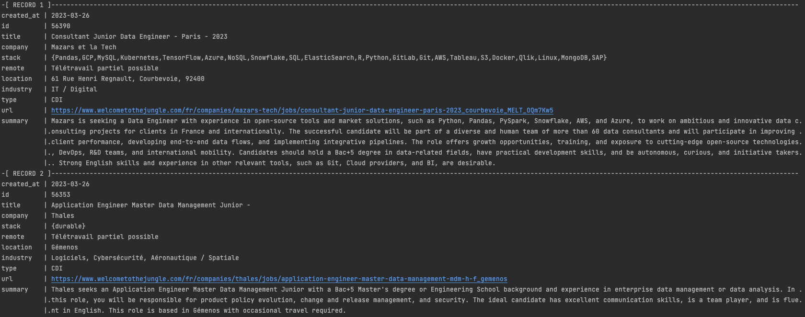

# Data Engineering Job Market

After finishing a bootcamp in 2022, I had a conception of data engineering very technology-centered. 
Months later, thanks to O'Reilly's _Fundamentals of Data Engineering_, I have more clarity with the role, but the variety of technical skills is still a major consideration when applying to jobs. 

The project will try to help getting a bigger picture of the technology landscape, as well as matching my profile with the fittest company. 


[The 2023 MAD Landscape - Matt Turck at FirstMark](https://mattturck.com/mad2023/#more-1693)

****
#### Contents

- [Architecture](#architecture)
- [Testing](#testing)
  - [End-to-end tests](#end-to-end-tests)
  - [Data quality testing](#data-quality-testing)
  - [Monitoring](#monitoring)
  - [Unit testing](#unit-testing)
- [Data Lifecycle](#data-lifecycle)
  - [Source System](#source-system)
  - [Ingestion](#ingestion)
  - [Transformation](#transformation)
  - [Serving](#serving)
  - [Storage](#storage)
  - [Orchestration](#orchestration)
- [How to run](#how-to-run)

****

## Architecture

A minimal pipeline using Python scripts, Postgres, Airflow and Tableau. 
Links to Python packages:
- Crawler: [data-job-crawler](https://github.com/FelitaD/data-job-crawler)
- ETL pipeline: [data-job-etl](https://github.com/FelitaD/data-job-etl)  
- API: [data-job-api](https://github.com/FelitaD/data-job-api)


C4 model diagrams: https://structurizr.com/workspace/79499/diagrams

## Testing

For individual pipelines tests see their respective repositories.

### Airflow Tests

- DAG file
  - `python3 job_market_etl_dag.py`
- Import time 
  - `time python3 job_market_etl_dag.py` 
  - Maximum is 30 seconds
- DAG loading 
  - `pytest tests/`
- List tasks and test them individually 
  - `airflow tasks list job-market-batch`
  - `airflow tasks test job-market-batch TASK 2022-01-01`
- Backfill
  - `airflow dags backfill job-market-batch --start-date 2023-01-01`
  - Takes account of dependencies 

### End-to-end Test

- Look at latest job posting
- Query `processed_jobs` table and compare results

- Example output :


### Data Quality Testing

- All technologies must be present 
  - Some technologies are written differently (eg. Google BigQuery, Google Big Query)
  - Have to be added manually in `config/definitions.py` from the ETL package
- Eliminate non data engineer jobs
  - About half the jobs despite the filters
  - Verify data engineer roles with `regex_data_engineer_roles.sql`
- Eliminate duplicate jobs 
  - Some jobs are reposted multiple times and have a different url each time
  - Removed by removing the last part of the url, see: `sql/truncate_urls.sql`
- Processing errors
  - To be added in the unit tests input
  - Some queries to spot error in `tests/processing_errors.sql` 
- Missing values
  - Only id, url, title and company have the `NOT NULL` constraint
  - Check other fields in `tests/missing_values.sql`

### Monitoring

To be completed.

### Unit Testing

Pytest
- Crawler coverage
- ETL coverage

## Data Lifecycle

### Source system

The data sources are the web pages containing results for the latest data engineering jobs.  The project started with [Spotify](https://www.lifeatspotify.com/jobs?c=engineering&c=data&l=london&l=stockholm&l=remote-emea&l=paris) and [Welcome To The Jungle](https://www.welcometothejungle.com/fr/jobs?page={page_number}&aroundQuery=&query=data%20engineer&refinementList%5Bcontract_type_names.fr%5D%5B%5D=CDI&refinementList%5Bcontract_type_names.fr%5D%5B%5D=CDD%20%2F%20Temporaire&refinementList%5Bcontract_type_names.fr%5D%5B%5D=Autres&refinementList%5Bcontract_type_names.fr%5D%5B%5D=VIE&refinementList%5Bcontract_type_names.fr%5D%5B%5D=Freelance) where I found my first tech job.

Characteristics:
- Javascript based pages require additional scraping library Playwright
- HTML will eventually change and requires detection as well as manual update of the XPath
- Different websites can show more or less fields (eg. remote policy) which will result in null values
- Schema evolution can occur
- If a job offer appears on at least 2 scraped websites, need to deal with duplicate

### Ingestion

The ingestion is made with Scrapy framework which adds a pipeline feature that conform the data into predefined fields and writes them to the database.

### Transformation

All transformations are made with Python in a specific ETL pipeline [data-job-etl](https://github.com/FelitaD/data-job-etl).
The processing consists of cleaning and reformatting fields and extracting the technology names from the text field into a new column. The data is finally modelled to be loaded in a new database.

### Storage

PostgreSQL is used as OLTP and OLAP stores. The data is uniformely structured with a small read and write workload.

#### Schema 

The raw data is stored in a mega relation. The field `text` is the biggest but should not reach the 1 GB capacity limitation. 
Once transformed, the data is loaded in a new table without normalization. A future implementation would differentiate 2 databases with the schemas:

 

### Orchestration

Airflow is run locally. Following best practices, the custom code is encapsulated in python packages then imported in the DAG.

## How to run

### Prerequesites

- Setup environment 
  - Activate venv and install requirements
  - Execute `playwright install` to download chromium
- Install Airflow with pypi: [official instructions](https://airflow.apache.org/docs/apache-airflow/stable/installation/installing-from-pypi.html)
- Create `job_market` database and export environment variables `JOB_MARKET_DB_USER` and `JOB_MARKET_DB_PWD`   

### Run

- ```airflow standalone``` will initialise Airflow database, make a user, and start all components (development phase).<br>  
- Airflow UI is at `localhost:8080` with username `admin` and password in `standalone_admin_password.txt`
- In DAGs tab, toggle on job-market-batch and trigger manually if not running.  


[Back to contents](#contents)